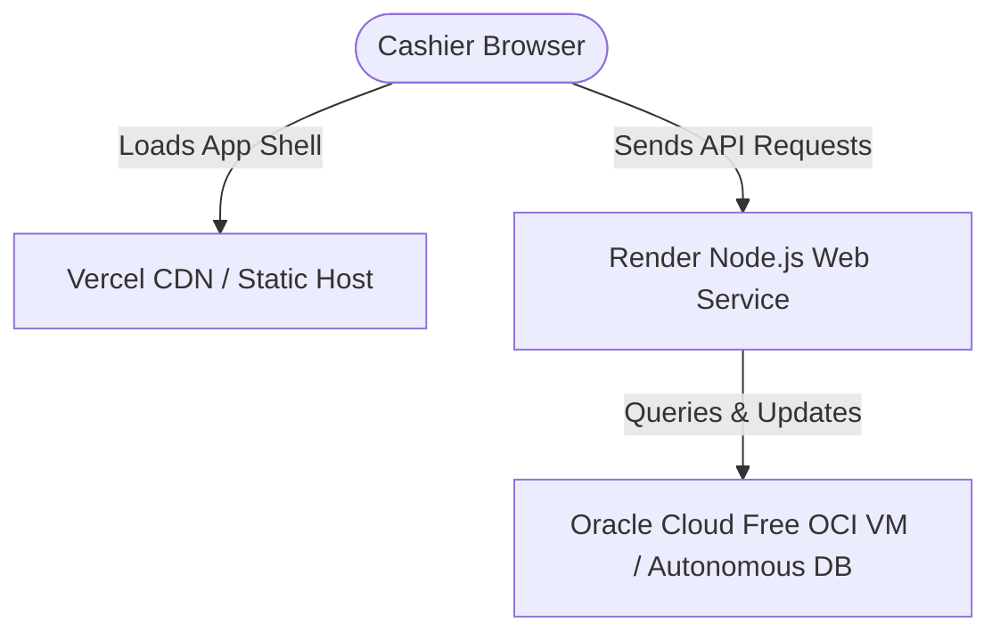

# 🚀 Bazar-Trace — Production Deployment Guide

This guide is designed for beginners. It explains how to deploy both the frontend and backend of **Bazar-Trace** to the web using **Always-Free** hosting providers, ensuring they connect and communicate correctly.

---

## 🗺️ Deployment Architecture Overview

In production, the application is divided into three separate components:



1.  **Frontend (PWA client):** Static HTML, CSS, and JS compiled by Vite. Hosted on **Vercel** or **Netlify** (Free CDN).
2.  **Backend (Express API):** Dynamic Node.js server. Hosted on **Render** (Free Web Service tier).
3.  **Database (Oracle DB):** Hosted on **Oracle Cloud Infrastructure (OCI) Always Free VM** running Docker, or **Oracle Autonomous DB**.

---

## 📦 Step 1: Push Code to GitHub

Before deploying to Vercel or Render, you must host your project source code on **GitHub**.

1.  **Create a GitHub Account:** Sign up at [github.com](https://github.com).
2.  **Create a New Repository:**
    *   Name it `versity-project` or `bazar-trace`.
    *   Set the visibility to **Private** or **Public**.
    *   Do **NOT** add a README, `.gitignore`, or license (they already exist in your workspace).
3.  **Initialize Git & Push Local Code:**
    Open your terminal in `c:\Users\workm\Desktop\VERSITY-PROJECT\bazar` and run:
    ```bash
    # Initialize Git
    git init

    # Add all files to staging (excludes node_modules automatically via .gitignore)
    git add .

    # Commit changes
    git commit -m "feat: ready for production deployment"

    # Link to your GitHub repository (replace with your actual repository URL)
    git remote add origin https://github.com/YOUR_USERNAME/YOUR_REPO_NAME.git

    # Push code
    git branch -M main
    git push -u origin main
    ```

---

## 🗄️ Step 2: Deploy the Oracle Database (Free Options)

An Oracle Database container requires at least **2GB of RAM** to run reliably. Standard free application tiers (like Render Free which offers only 512MB RAM) cannot run Oracle DB.

### 🌟 Recommended: Oracle Cloud Infrastructure (OCI) Always Free VM
Oracle offers a generous **Always Free Tier** that provides **up to 4 ARM Ampere compute instances with 24 GB of RAM** in total. This is more than enough to host your Dockerized database and backend forever at no cost.

1.  **Sign up for OCI Always Free:** [oracle.com/cloud/free/](https://oracle.com/cloud/free/)
2.  **Spin up a VM Compute Instance:**
    *   Choose **Ubuntu** as the Operating System.
    *   Assign **2 OCPUs and 12 GB RAM** (fits inside the free limits).
3.  **Install Docker and Docker Compose on the VM:**
    SSH into your new instance and run:
    ```bash
    sudo apt update
    sudo apt install -y docker.io docker-compose
    ```
4.  **Copy your Database Configuration:**
    Create a folder named `bazar-db` on the VM, copy your `docker-compose.yml` into it, and start the container:
    ```bash
    docker-compose up -d
    ```
5.  **Open Security Ports:**
    In your OCI Console, under *Virtual Cloud Network* -> *Security Lists*, add an **Ingress Rule** to allow TCP traffic on port `1521` (Oracle DB port) so your backend can connect to it.

---

## 🖥️ Step 3: Deploy the Backend on Render

Render is a platform that hosts Node.js applications for free.

1.  **Sign up for Render:** Go to [render.com](https://render.com) and link your GitHub account.
2.  **Create a New Web Service:**
    *   Click **New** -> **Web Service**.
    *   Select your `versity-project` repository.
3.  **Configure Service Settings:**
    *   **Name:** `bazar-trace-backend`
    *   **Region:** Choose the region closest to Bangladesh (Singapore or Oregon).
    *   **Root Directory:** `backend` (Crucial! The backend code is inside the subfolder).
    *   **Runtime:** `Node`
    *   **Build Command:** `npm install`
    *   **Start Command:** `npm start`
4.  **Add Environment Variables:**
    Scroll down to **Environment Variables** and add the following keys:
    *   `NODE_ENV` = `production`
    *   `PORT` = `10000` (Render will override this dynamically, which Express handles)
    *   `JWT_SECRET` = `choose_a_strong_random_secret_key`
    *   `DB_USER` = `system`
    *   `DB_PASSWORD` = `your_oracle_db_password`
    *   `DB_CONNECT_STRING` = `YOUR_OCI_VM_PUBLIC_IP:1521/FREE` (Points to the Oracle DB running on your VM)
5.  **Deploy:** Click **Create Web Service**. Once deployed, Render will provide a public URL like:
    `https://bazar-trace-backend.onrender.com`

---

## 🌐 Step 4: Deploy the Frontend on Vercel

Vercel hosts static frontend sites for free on global CDNs.

1.  **Sign up for Vercel:** Go to [vercel.com](https://vercel.com) and sign up using GitHub.
2.  **Import Project:**
    *   Click **Add New** -> **Project**.
    *   Select your repository.
3.  **Configure Framework & Directories:**
    *   **Framework Preset:** `Vite` (Vercel automatically detects this).
    *   **Root Directory:** `frontend` (Crucial! Select the frontend subfolder).
4.  **Add Build Settings:**
    *   **Build Command:** `npm run build`
    *   **Output Directory:** `dist`
5.  **Add Environment Variables:**
    Under the environment variables section, add:
    *   `VITE_API_URL` = `https://bazar-trace-backend.onrender.com/api/v1` (Paste your Render backend API URL here)
6.  **Deploy:** Click **Deploy**. Vercel will build your static files and generate a public URL like:
    `https://bazar-trace.vercel.app`

---

## 🔒 Step 5: Configure CORS (Security Check)

Because your frontend sits on a Vercel domain (e.g., `vercel.app`) and requests data from a Render domain (e.g., `onrender.com`), browsers block requests by default unless **CORS (Cross-Origin Resource Sharing)** is enabled.

Our backend is already configured to allow all origins in development. To secure it in production:

1.  Open `backend/src/app.js`.
2.  Locate the CORS configuration block:
    ```javascript
    app.use(cors({
      origin: process.env.FRONTEND_URL || '*',
      credentials: true
    }));
    ```
3.  On your Render dashboard for the backend, add the environment variable:
    *   `FRONTEND_URL` = `https://bazar-trace.vercel.app` (Your production frontend URL)

This ensures only your deployed frontend is allowed to query your database.

---

## 💡 Troubleshooting Checklist for Beginners

*   **Offline / Mix-up errors:** Ensure you write `https://` in environment variables.
*   **Database connection refused:**
    *   Check if port `1521` is open in your cloud provider's firewall dashboard.
    *   Double check that the VM database container is active: run `docker ps` on your VM terminal.
*   **Production updates:** When you push new code to your GitHub `main` branch, both Vercel and Render will automatically detect the changes, pull the new code, rebuild, and deploy the updates in real-time!
