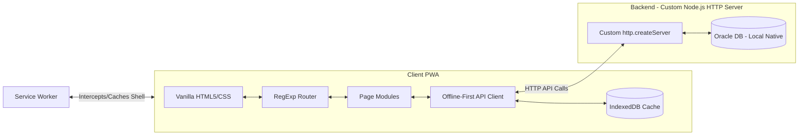
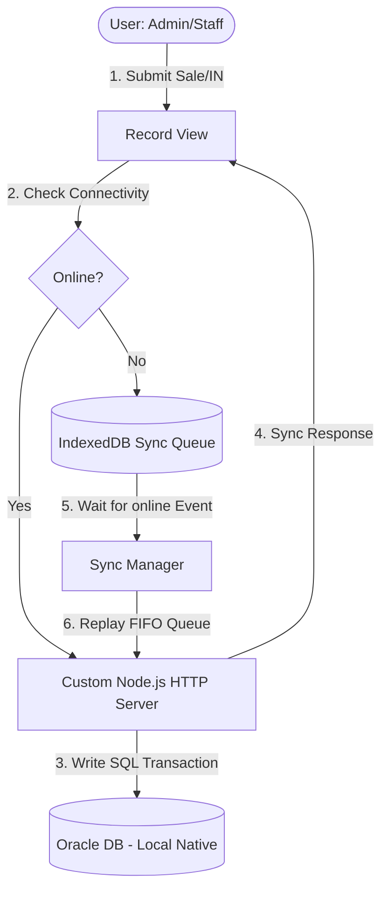
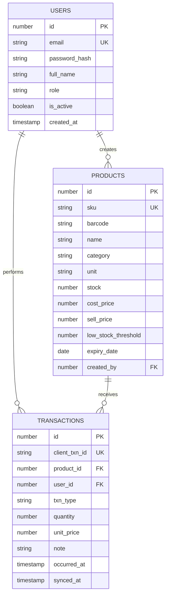
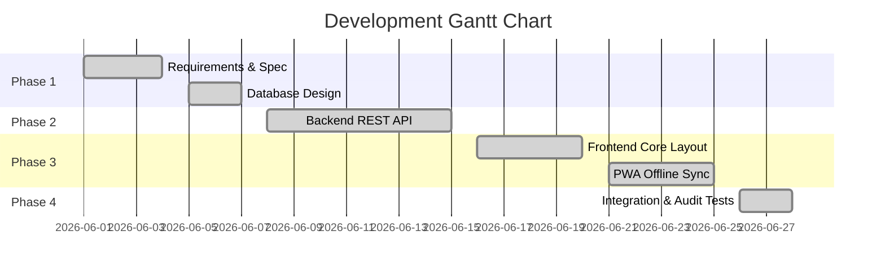

# 📊 Bazar-Trace — Defense Presentation Slides

This document contains your complete presentation slides script and layout, formatted to match the style of your University of Scholars e-commerce reference slides. It is customized for your solo presentation on **Bazar-Trace**.

---

## Slide 1: Title Slide
*   **Slide Header:** University of Scholars
*   **Main Title:** Bazar-Trace: Offline-First PWA Stock & Inventory Management System
*   **Subtitle:** Built with HTML, CSS, Vanilla JS, Node.js (Custom HTTP Server) & Oracle Database (Local)
*   **Presenter Information:**
    *   **Name:** Arif Hossen
    *   **ID/Roll Number:** 231010687
    *   **Department:** Computer Science & Engineering (CSE)
*   **Supervision:**
    *   **Supervisor:** Reduanul Bari Subhon sir
    *   **Mentor:** Israt Jahan miss
*   **Visual Suggestion:** A clean title card displaying the University of Scholars logo on an indigo-slate background.
*   **Speaker Notes:**
    > "Honorable members of the defense board, supervisor, and teachers, welcome to my defense presentation. I am Arif Hossen, student ID 231010687. Today I will present my capstone project: 'Bazar-Trace', an offline-first progressive web application for stock and inventory management, built under the guidance of my supervisor, Reduanul Bari Subhon."

---

## Slide 2: What is Bazar-Trace?
*   **Slide Title:** What is Bazar-Trace?
*   **Core Concepts:**
    *   **Vanilla Single Page Application:** An SPA built purely with raw ES Modules, HTML5, and CSS variables (no React, Next.js, or Tailwind CSS).
    *   **Offline-First Sync Engine:** Designed to continue recording transactions and looking up products even when the internet drops.
    *   **Role-Based Security:** Strict separation of admin management and staff registry options.
    *   **Mobile-First Design:** Optimized for low-end devices and simple mobile browsers.
*   **Visual Suggestion:** Left column with list bullets; right column showing mock dashboard metrics cards.
*   **Speaker Notes:**
    > "Bazar-Trace is a Single Page Application designed to solve retail inventory issues in areas with unstable internet. Unlike standard web platforms, it operates in a fully disconnected environment. The application runs on raw frontend code as required by university guidelines, backed by a custom Node.js HTTP server — built without Express — and an Oracle Database running natively on the local machine."

---

## Slide 3: Motivation
*   **Slide Title:** Motivation & Problem Statement
*   **Key Drivers:**
    1.  **Internet Instability:** Retail shops in Bangladesh frequently suffer from network drops, rendering standard cloud tools unusable.
    2.  **High Overhead Costs:** Small store owners cannot afford expensive desktop setups or heavy software licenses.
    3.  **UI/UX Clutter:** Existing ERP and inventory portals are too complex for non-technical cashiers.
    4.  **Academic Constraint:** The challenge of building sophisticated offline sync and real-time canvas charting without relying on heavy third-party libraries.
*   **Visual Suggestion:** A visual comparison slide: red warning highlight for "Cluttered Cloud ERP" vs green check highlight for "Bazar-Trace Local PWA".
*   **Speaker Notes:**
    > "Our primary motivation stems from the infrastructure challenges in local retail shops. When internet connection fails, sales stop because traditional cloud services disconnect. Furthermore, cashiers need simple, zero-lag interfaces. I set out to prove that by using raw Web APIs like Service Workers and IndexedDB, we can build a lightweight system that runs offline without costly framework overhead."

---

## Slide 4: Project Goals
*   **Slide Title:** Project Goals
*   **Core Objectives:**
    1.  **Zero Downtime:** Enable cashiers to record Sales (OUT) and Stock received (IN) with zero latency during offline states.
    2.  **Conflict-Free Auto Synchronization:** Replay offline mutations in strict FIFO order on network recovery, handling sync retries idempotently.
    3.  **Hardware Integrations:** Access native camera modules for barcode scanning and trigger synthesized audio scan beeps.
    4.  **Resource Constraints Compliance:** Build the entire system under the strict university guidelines (Vanilla CSS, raw JS, Oracle DB).
*   **Visual Suggestion:** A set of target icons representing: Sync, Camera Scanner, 100% Uptime, and Oracle DB.
*   **Speaker Notes:**
    > "The main goals are: first, guarantee 100% uptime for transaction logging. Second, design a background sync system that preserves sequential order and avoids database conflicts on retry. Third, integrate mobile hardware like the camera for scanning, and fourth, meet all academic limits using pure, vanilla technologies."

---

## Slide 5: High-Level Architecture (The Big Picture)
*   **Slide Title:** High-Level Architecture
*   **Diagram:**

*   **Speaker Notes:**
    > "This is the architecture of Bazar-Trace. On the client side, a RegExp router serves lazy-loaded pages. The API client communicates with the backend, but caches everything in IndexedDB. If the client loses connection, the API client diverts mutations to a local queue. The Service Worker runs in the background, caching all assets so the app loads instantly. The backend is a custom Node.js HTTP server — no Express — connecting to a locally installed Oracle database via oracledb Thin mode."

---

## Slide 6: Technology Used
*   **Slide Title:** Technology Stack
*   **Technology Breakdown:**
    *   **Frontend Core:** HTML5, CSS Variables layout system, ES6 JavaScript Modules.
    *   **PWA Engine:** Service Worker (Stale-While-Revalidate caching), Browser IndexedDB API.
    *   **Hardware APIs:** Web MediaDevices (`getUserMedia`), Browser Native `BarcodeDetector` API, Web Audio API (Synthesizer).
    *   **Backend Core:** Node.js (ESM, `--watch` mode) — **custom `http` server, zero framework**. Hand-built router, middleware pipeline, body parser, CORS handler, and request logger.
    *   **Database:** Oracle Database XE 21c — running **natively on local machine**, connected via `oracledb` v6 Thin mode (`localhost:1521/XEPDB1`). No Oracle Instant Client required.
    *   **Infrastructure:** Docker Compose (production stack only), Git/GitHub.
*   **Visual Suggestion:** Grid layout with standard tech icons (HTML, CSS, JS, Node, Oracle) — replace Docker icon with a local-server icon.
*   **Speaker Notes:**
    > "Here is our tech stack. Instead of using Express.js, we built our own HTTP server on top of Node.js's built-in `http` module — writing all routing, middleware, CORS, and body parsing from scratch. For the database, Oracle XE 21c runs natively on the developer's machine. We use the `oracledb` v6 Thin mode driver, which requires no Oracle Instant Client installation — just a simple connection string. The frontend is built entirely on pure web standards."

---

## Slide 7: Functional Requirements
*   **Slide Title:** Functional Requirements
*   **Role-Based Features:**
    *   **Common / Staff Features:**
        *   Secure Login / Session validation.
        *   Log transactions (Sale OUT / Stock Received IN).
        *   Search products (via dynamic autocomplete selector).
        *   Scan barcodes with the camera to autofill forms.
    *   **Administrator Features:**
        *   Full Product Management (Create, Edit details, Set stock alerts, Delete).
        *   Settings Control Directory (Register staff accounts, Toggle active statuses).
        *   Dashboard analytics (Live stock counts, Canvas-drawn sales graphs, Expiry warning lists).
*   **Visual Suggestion:** Split table columns contrasting Cashier/Staff options with Admin privileges.
*   **Speaker Notes:**
    > "For user security, Bazar-Trace divides permissions between Admin and Staff. Staff members focus on logging transactions and searching inventory. Administrators hold permissions to create and delete products, register cashiers, toggle active statuses, and view financial profit/loss graphs on the dashboard."

---

## Slide 8: Non-Functional Requirements
*   **Slide Title:** Non-Functional Requirements
*   **Key Parameters:**
    *   **Performance:** UI response time under 50ms; Vite static bundle load under 200ms.
    *   **Availability:** 100% operational offline. The app shell is cached, allowing disconnections at any stage.
    *   **Reliability:** The FIFO sync queue prevents duplicate inserts by sending unique transaction UUIDs to the database.
    *   **Security:** Cryptographic Bcrypt hashing for credentials and token-based JWT route authentication.
    *   **Usability:** Minimalist layouts, clear alert warning badges, and automatic input formatting.
*   **Speaker Notes:**
    > "Our non-functional priorities center on reliability and responsiveness. The UI maintains sub-50ms render times. The offline sync engine must be bulletproof; transaction UUIDs protect the database from duplicate entries during network reconnect spikes. Security is maintained through Bcrypt password hashing and JWT authentication."

---

## Slide 9: Data Flow Diagram (DFD Level-1)
*   **Slide Title:** Data Flow Diagram (DFD) — Level 1
*   **DFD Mapping:**

*   **Speaker Notes:**
    > "This Level-1 DFD traces the lifecycle of a logged transaction. The cashier submits a sale. The client checks connection. If online, the transaction goes to our custom Node.js HTTP server and is written to the locally running Oracle Database. If offline, the transaction is logged in the IndexedDB Sync Queue. Once the browser detects the 'online' event, the Sync Manager replays the queue in FIFO order, pushing updates to the backend."

---

## Slide 10: Entity Relationship (ER) Diagram
*   **Slide Title:** Entity Relationship (ER) Diagram
*   **ERD Mapping:**

*   **Speaker Notes:**
    > "This is our database ER diagram. The USERS table maintains credentials and system roles. Users create PRODUCTS and perform TRANSACTIONS. The TRANSACTIONS table joins products and users, recording type, quantity, prices, notes, and the client UUID key used for idempotency."

---

## Slide 11: Database Design (SQL Schema)
*   **Slide Title:** Oracle SQL Schema Configuration
*   **DDL Code Box:**
```sql
CREATE TABLE users (
  id NUMBER GENERATED BY DEFAULT AS IDENTITY PRIMARY KEY,
  email VARCHAR2(100) UNIQUE NOT NULL,
  password_hash VARCHAR2(255) NOT NULL,
  full_name VARCHAR2(120) NOT NULL,
  role VARCHAR2(20) DEFAULT 'STAFF' NOT NULL,
  is_active NUMBER(1) DEFAULT 1 NOT NULL
);

CREATE TABLE products (
  id NUMBER GENERATED BY DEFAULT AS IDENTITY PRIMARY KEY,
  sku VARCHAR2(50) UNIQUE NOT NULL,
  barcode VARCHAR2(100),
  name VARCHAR2(150) NOT NULL,
  stock NUMBER DEFAULT 0 NOT NULL,
  cost_price NUMBER(10,2) NOT NULL,
  sell_price NUMBER(10,2) NOT NULL,
  low_stock_threshold NUMBER DEFAULT 5 NOT NULL,
  expiry_date DATE
);

CREATE TABLE transactions (
  id NUMBER GENERATED BY DEFAULT AS IDENTITY PRIMARY KEY,
  client_txn_id VARCHAR2(50) UNIQUE NOT NULL,
  product_id NUMBER REFERENCES products(id),
  user_id NUMBER REFERENCES users(id),
  txn_type VARCHAR2(10) CHECK (txn_type IN ('IN', 'OUT')),
  quantity NUMBER NOT NULL,
  unit_price NUMBER(10,2) NOT NULL,
  occurred_at TIMESTAMP DEFAULT SYSTIMESTAMP
);
```
*   **Speaker Notes:**
    > "This SQL schema maps directly to our Oracle Database tables. We use generated identity columns for primary keys, foreign key constraints for integrity, check constraints on types, and unique indexes on `sku` and `client_txn_id` to prevent conflicts."

---

## Slide 12: Development Timeline (Gantt Chart)
*   **Slide Title:** Project Development Timeline
*   **Gantt Chart:**

*   **Speaker Notes:**
    > "This Gantt Chart outlines my development timeline. I spent the first week on requirements and database schema planning. The second week was dedicated to building the backend REST API. The third week focused on frontend SPA layouts and offline sync logic. Finally, integration audits and testing were completed during the fourth week."

---

## Slide 13: SWOT Analysis
*   **Slide Title:** SWOT Analysis
*   **SWOT Matrix:**
    *   **Strengths (S):**
        *   100% offline uptime via IndexedDB and Service Workers.
        *   Ultralight load sizes (zero JavaScript framework overhead).
        *   Conflict-free transactions via client UUID checks.
    *   **Weaknesses (W):**
        *   Database updates rely on client synchronization triggers.
        *   Camera barcode detection requires modern browser support.
    *   **Opportunities (O):**
        *   Expand into multi-terminal retail point-of-sale setups.
        *   Integrate with local hardware receipt printers.
    *   **Threats (T):**
        *   Device clear-cache commands could affect unsynced offline data.
        *   Evolving browser security standards for camera feeds.
*   **Speaker Notes:**
    > "Our SWOT highlights: our major Strength is the PWA framework providing offline transaction safety without loading heavy code bundles. Our main Weakness is that updates depend on the client reconnecting to trigger synchronization. Opportunities include printing receipts, while Threats include cache clears on local devices."

---

## Slide 14: Project Cost Analysis
*   **Slide Title:** Project Cost Analysis (Estimation in BDT)
*   **Cost Table:**

| Development Phase / Category | Cost Estimate (BDT) | Actual Solo Cost (BDT) |
| :--- | :---: | :---: |
| **Design & UI/UX** | 10,000 - 15,000 | 0 *(Done by Student)* |
| **Frontend Development** | 45,000 - 60,000 | 0 *(Done by Student)* |
| **Backend Development** | 60,000 - 80,000 | 0 *(Done by Student)* |
| **Testing & QA** | 15,000 - 25,000 | 0 *(Done by Student)* |
| **Production Domain & Hosting** | 5,000 - 10,000 | 0 *(Local machine / dev environment)* |
| **Oracle Database (Local Install)** | 12,000 - 24,000 | 0 *(Oracle XE 21c — free local install)* |
| **Total Estimation** | **147,000 - 214,000 BDT** | **0 BDT (Academic Project)** |

*   **Speaker Notes:**
    > "This slide outlines the market cost analysis in BDT. A commercial version of this application would cost between 1.5 to 2 Lakh BDT to design, build, test, and host. However, because this is an academic project built entirely by myself using Always-Free hosting resources, the cost of development is zero."

---

## Slide 15: Conclusion & Thank You
*   **Slide Title:** Thank You
*   **Key takeaways:**
    *   **Bazar-Trace** is a fully functional, offline-resilient inventory application.
    *   Satisfies university requirements using pure vanilla code and relational Oracle schemas.
    *   Demonstrates how modern Web APIs can replace heavy commercial frameworks.
*   **Visual Suggestion:** A clean thank you card with your details (Name, ID, Supervisor name) and a prompt for panel questions.
*   **Speaker Notes:**
    > "To conclude, Bazar-Trace proves that we can build robust, offline-first systems using pure web standards. It is ready for deployment and everyday store use. I would like to thank my supervisor for his guidance, and I am now ready to take any questions from the panel. Thank you."
