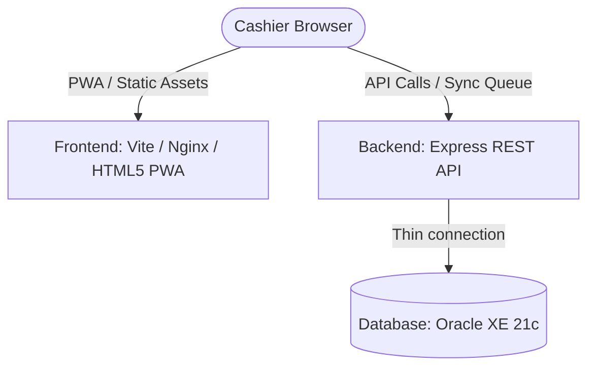

# 🚀 Bazar-Trace — Comprehensive Running Guide

Welcome to the running guide for **Bazar-Trace**, a mobile-first PWA for inventory and stock management designed for low-connectivity environments. 

This guide details two primary methods of running the application:
1. **Docker Compose Mode (Recommended)**: Runs the entire stack (Oracle DB, Node.js API, and static frontend) automatically.
2. **Local Development Mode**: Runs the API and PWA directly on your machine (can run with Oracle disabled for quick scaffolding verification).

---

## 🏛️ System Architecture

The application is structured as a three-tier system:



*   **Frontend**: Plain HTML, CSS, JavaScript, Service Worker (Workbox), and IndexedDB served by Vite in development and Nginx in production.
*   **Backend**: Node.js, Express, Winston logger, and Zod validation, connecting to Oracle using the `oracledb` Thin mode driver.
*   **Database**: Oracle 21c Express Edition (XE).

---

## 🐳 Method 1: Running with Docker Compose (Recommended)

This method starts all services (Oracle DB, backend server, and frontend server) in isolated containers with a single command.

### 📋 Prerequisites
*   [Docker Desktop](https://www.docker.com/products/docker-desktop/) installed and running.
*   At least **8 GB RAM** free on your machine.
*   An active internet connection to download the required base images (approx. 2 GB).

---

### 🚶 Step-by-Step Execution

#### Step 1: Open PowerShell / Terminal in the Project Directory
Ensure you are in the workspace root:
```powershell
cd c:\Users\workm\Desktop\UN\bazar-trace
```

#### Step 2: Build and Start Containers
Run the Docker Compose command to build and launch all containers in detached mode:
```powershell
docker compose up -d --build
```
*   `-d`: Detached mode (runs containers in the background).
*   `--build`: Automatically builds the backend and frontend custom images.

#### Step 3: Wait for Oracle Database Initialization
Oracle XE takes **3–5 minutes** to initialize the database database files during the first boot.
You can monitor its status by running:
```powershell
docker compose logs -f oracle
```
Wait until you see the following line in the logs before proceeding:
```text
DATABASE IS READY TO USE!
```
*(Press `Ctrl + C` to exit the logs view).*

#### Step 4: Run Database Migrations
Once the database is ready, apply the SQL schema migrations to create tables, views, and sequences:
```powershell
docker compose exec backend npm run db:migrate
```

#### Step 5: Seed the Database
Seed the application with a default administrator account and dummy test data:
*   **Seed Admin Account**:
    ```powershell
    docker compose exec backend npm run db:seed:admin
    ```
*   **Seed Dummy/Test Data** (Products, transactions, low-stock items):
    ```powershell
    docker compose exec backend npm run db:seed:dummy
    ```

#### Step 6: Access the App
Open your browser and navigate to:
*   **Frontend (PWA)**: [http://localhost:8080](http://localhost:8080)
*   **Backend Health Endpoint**: [http://localhost:5000/api/v1/health](http://localhost:5000/api/v1/health)

---

## 💻 Method 2: Local Development (Without Docker)

You can run the frontend and backend applications directly on your host machine. The backend can run in **scaffolding mode** (Oracle DB disabled) so you can inspect the endpoints and app shell without setting up Oracle locally.

### 📋 Prerequisites
*   [Node.js](https://nodejs.org/) version `18.17.0` or higher installed.

---

### 🚶 Step-by-Step Execution

### 1. Set Up and Run the Backend

#### Step 1: Navigate to the `backend` folder and install dependencies:
```powershell
cd backend
npm install
```

#### Step 2: Configure Environment Variables
Copy the template configuration file:
```powershell
cp .env.example .env
```
Open `backend/.env` in your editor. 
*   **To run without Oracle (Local Scaffolding Mode)**: Set `ORACLE_ENABLED=false`. The application will start successfully, but any database dependent actions will return scaffolding messages.
*   **To run with a Local Oracle Instance**: 
    1. Set `ORACLE_ENABLED=true`.
    2. Set `ORACLE_USER`, `ORACLE_PASSWORD`, and `ORACLE_CONNECT_STRING` to match your local Oracle instance credentials.

#### Step 3: Start the Backend Development Server
```powershell
npm run dev
```
The server will run at [http://localhost:5000](http://localhost:5000) and watch for file changes.

#### Step 4 (If Oracle is Enabled): Run Migrations and Seed
If you set `ORACLE_ENABLED=true` in your `.env`:
```powershell
# Run migrations
npm run db:migrate

# Seed Admin User
npm run db:seed:admin

# Seed Dummy/Mock Data
npm run db:seed:dummy
```

---

### 2. Set Up and Run the Frontend

#### Step 1: Open a new terminal window, navigate to the `frontend` folder, and install dependencies:
```powershell
cd frontend
npm install
```

#### Step 2: Configure Environment Variables
Copy the template configuration:
```powershell
cp .env.example .env
```
*(By default, the Vite configuration is set up to proxy `/api` requests to `http://localhost:5000` automatically).*

#### Step 3: Start Vite Dev Server
```powershell
npm run dev
```
The client app will be live at [http://localhost:5173](http://localhost:5173).

---

## 🔑 Default Credentials

After seeding the admin, you can log into the frontend app with the following defaults:
*   **Email**: `admin@bazar-trace.local`
*   **Password**: `Admin@123`
*   **Role**: `ADMIN`

---

## 🛠️ Common Commands Cheat Sheet

### Docker Compose
| Action | Command |
|---|---|
| Start stack in background | `docker compose up -d` |
| Rebuild and restart stack | `docker compose up -d --build` |
| Stop all containers | `docker compose down` |
| Reset data (Delete Volume) | `docker compose down -v` *(⚠️ Warning: Deletes DB data!)* |
| Show status of containers | `docker compose ps` |
| Check backend logs | `docker compose logs -f backend` |
| Check oracle logs | `docker compose logs -f oracle` |

### Running Database Scripts (Inside Docker)
*   **Migrate Database**: `docker compose exec backend npm run db:migrate`
*   **Seed Admin**: `docker compose exec backend npm run db:seed:admin`
*   **Seed Dummy Data**: `docker compose exec backend npm run db:seed:dummy`

### Running Backend Tests
Ensure dependencies are installed in the backend folder, then run the native Node test runner:
```powershell
cd backend
npm test
```

---

## ❓ Troubleshooting

### ORA-12541: Connection Refused / No Listener
*   **Docker Mode**: Oracle is still starting. Run `docker compose logs -f oracle` to check the boot progress. Wait for `DATABASE IS READY TO USE!`.
*   **Local Mode**: Verify that your Oracle DB service is running locally and that port `1521` is listening.

### Port 1521/1522 is already allocated (Docker Compose)
To avoid port conflicts with other Oracle databases running on your host (which defaults to `1521`), the `docker-compose.yml` has been updated to expose the database on port **`1522`** of your host (`1522:1521`).
*   **Manual DB Tools**: If you use external GUI database tools from your host (like DBeaver or SQL Developer), connect using host `localhost` and port **`1522`**.
*   **Docker Internal Networking**: The backend container connects internally via the Docker bridge network to `oracle:1521/XEPDB1` (which does not require changing the backend configurations).

### Resetting the Docker DB to a Clean State
If you run into issues or want to start with clean test data:
```powershell
# Stop stack and delete volume data
docker compose down -v

# Start again
docker compose up -d

# Wait for Oracle, then rerun migrations & seeds
docker compose exec backend npm run db:migrate
docker compose exec backend npm run db:seed:admin
```
